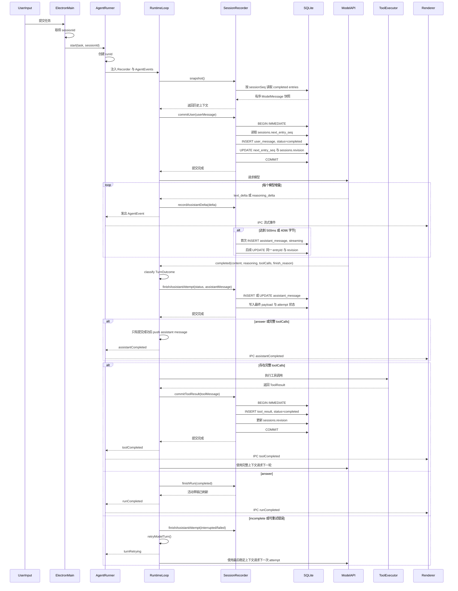
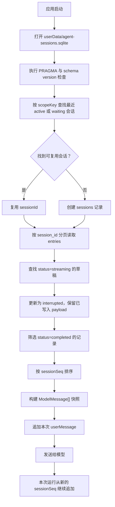
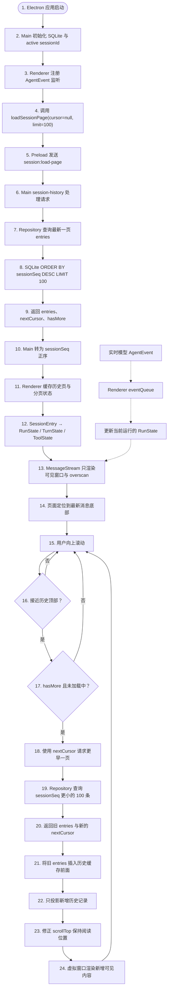

这组图描述当前已经实现的会话本地存储细节。Mermaid 源码可以直接修改，文档系统会根据源码重新渲染。

本页同时保留流程的文字说明。图表用于查看调用关系和时间顺序，文字用于解释每个阶段的职责、数据变化和继续条件。

## 参与者职责

- Electron Main 负责打开 `userData/agent-sessions.sqlite`，选择或创建后台会话，并向一次运行提供稳定的 `sessionId`。
- AgentRunner 为每次用户提交创建 `runId`，把 SessionRecorder、取消信号和 AgentEvent 接收器注入 Runtime。
- Runtime Loop 负责控制提交顺序。它把用户消息、助手完整消息和工具结果提交到 Recorder，并决定什么时候请求模型、执行工具和结束运行。
- SessionRecorder 维护已完成消息快照、当前助手草稿和串行 SQLite 写入队列。
- SQLite 保存 `sessions` 会话元数据和 `entries` 模型可见消息。`sessionSeq` 定义同一会话中的恢复顺序，`revision` 定义记录的条件更新版本。
- Renderer 继续接收 AgentEvent，用于流式展示。Renderer 的事件队列与 Recorder 的数据库写入队列保持独立。

## 单次运行与提交屏障

这张时序图强调每个动作的先后关系。Recorder 的 Promise 完成表示对应的本地提交已经完成，Runtime 才会继续下一步。

一次运行从一个确定的后台会话开始。Main 先取得 `sessionId`，Runner 再创建本次运行的 `runId`。Runtime 使用 Recorder 的 `snapshot()` 读取当前会话中已经完成的 `ModelMessage[]`，然后把本次用户输入追加到内存上下文。

用户消息的持久化发生在第一次模型请求之前。`commitUser` 在 SQLite 中开启 `BEGIN IMMEDIATE`，读取 `sessions.next_entry_seq` 作为本条记录的 `sessionSeq`，插入一条 `user_message`，递增 `next_entry_seq` 和会话 `revision`，最后执行 `COMMIT`。只有这个 Promise 成功完成，Runtime 才调用 Provider。

模型开始输出后，Runtime 对每个 `text_delta` 和 `reasoning_delta` 执行两条并行路径。第一条路径把增量作为 AgentEvent 发送给 Runner，再由 IPC 送到 Renderer；第二条路径把增量追加到 Recorder 的内存助手草稿。Recorder 按 500ms 或 4096 字节阈值合并刷新草稿，因此模型流不需要等待每一次磁盘写入才能继续接收。

草稿第一次刷新时，Recorder 创建一条 `assistant_message`，状态为 `streaming`，并取得固定的 `entryId` 与 `sessionSeq`。后续刷新使用同一个 `entryId`，通过 `revision` 条件更新 payload。模型流结束后，Runtime 先把聚合结果分类为 `answer`、`tool_calls`、`incomplete` 或 `failed`，再调用 `finishAssistantAttempt`。完整结果更新为 `completed`，不完整 attempt 更新为 `interrupted`，不可恢复错误更新为 `failed`。

完整 Assistant Message 提交后，Runtime 才把它加入当前内存上下文并发出 `assistantCompleted`。如果存在工具调用，Runtime 执行工具，使用返回的 `ToolResult` 构造 `ToolMessage`，等待 `commitToolResult` 以事务追加 `tool_result`，再把这条结果加入当前内存上下文并发出 `toolCompleted`。所有工具结果提交完成后，Runtime 使用完整上下文请求下一轮模型。如果没有工具调用，Runtime 调用 `finishRun(completed)`，刷新剩余草稿并发出唯一的 `runCompleted`。

提交失败会停止后续动作。用户消息提交失败时，Provider 保持待调用状态；Assistant attempt 提交失败时，工具保持待执行状态；工具结果提交失败时，下一轮模型请求保持待调用状态。模型流缺少 `finish_reason` 时，Adapter 抛出可重试的 `model_protocol` 错误，Runtime 保存当前 attempt 后调用 `retryModelTurn()`；重试耗尽后才通过 `finishRun(failed)` 结束运行。

## 启动恢复与模型上下文

这张流程图说明进程重启后如何恢复同一个后台会话，以及哪些记录进入下一次模型请求。

应用启动后，Main 初始化 SQLite 参数和 schema version，并按 `scopeKey` 查询最近的 `active` 或 `waiting` 会话。已找到的会话继续使用原来的 `sessionId`；没有可复用会话时，Main 创建新的 `sessions` 记录。

Recorder 按 `session_id` 分页读取 `entries`。遗留的 `streaming` 助手草稿更新为 `interrupted`，已经写入的 payload 保留在本地，供页面历史和故障诊断使用。模型上下文只从 `completed` 的 `user_message`、`assistant_message` 和 `tool_result` 构建，并按照 `sessionSeq` 升序恢复。

恢复出的快照不会把新的用户消息写入旧的内存数组后直接发送。Runtime 先把本次用户消息通过 `commitUser` 提交到本地，再把它追加到本次请求的消息数组，保证磁盘历史、内存上下文和模型请求使用同一个顺序。

关键约束：

- `commitUser` 成功后才开始第一次模型请求。
- `recordAssistantDelta` 立即更新内存草稿，SQLite 写入按时间或字节阈值合并。
- `finishAssistantAttempt(completed)` 成功后才把 Assistant Message 加入上下文并执行工具。
- `commitToolResult` 成功后才开始下一次模型请求。
- `finishRun` 刷新活动草稿后才发出 `runCompleted`。
- 页面 AgentEvent 和 Recorder 使用同一个 Runtime 增量来源，但分别维护 IPC 事件队列和 SQLite 写入队列。

## 当前范围

当前流程覆盖会话本地保存、流式草稿恢复、模型上下文恢复和工具回合中的模型可见消息。上下文压缩、跨会话检索、长期记忆提炼和页面历史读取 IPC 通过稳定的 `sessionId`、`runId`、`turnId`、`toolCallId` 和 `entryId` 接入当前流程。工具执行的持久化阶段、恢复与安全重放由[工具执行恢复](./tools/recovery.mdx)定义。

## 历史分页与虚拟渲染流程

下面的流程只描述 Electron 页面启动、历史分页和虚拟渲染。它与模型实时输出共用 Renderer 状态，但历史读取通过独立的 Main IPC 请求完成。

