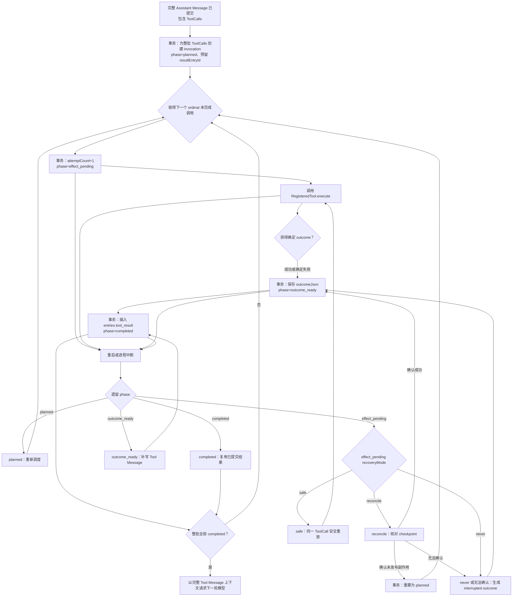
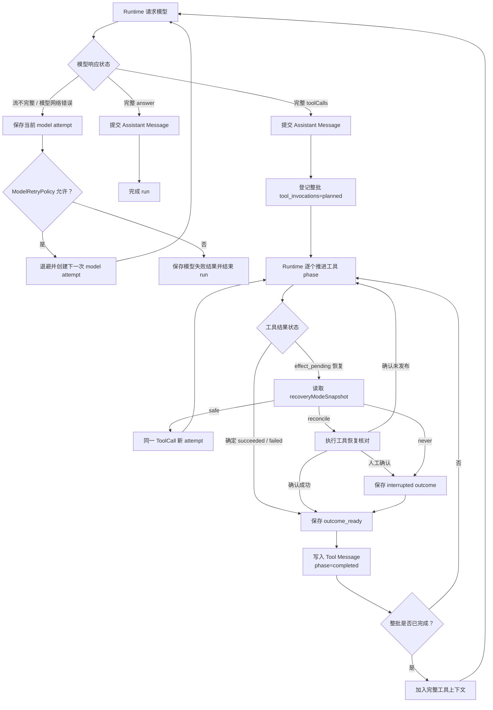

本文定义工具执行恢复契约。它从完整 Assistant Message 已持久化、其中包含一个或多个 ToolCall 开始，规定 Runtime 在进程退出、工具自身网络异常或结果提交中断后，如何决定重放、状态核对、结果物化或停止。

恢复协调器读取执行记录，完成恢复后生成模型可见的 Tool Message。

## 职责边界

`entries` 保存模型可见会话消息：`user_message`、`assistant_message` 和 `tool_result`。它是模型上下文的事实来源。

`tool_invocations` 保存工具执行控制事实；`entries` 保存模型可见消息。一个模型 ToolCall 对应一条 invocation；一条 invocation 可以因安全重放产生多次物理执行。

`toolCallId` 是模型产生的一次逻辑调用身份。模型收到失败 Tool Message 后产生新的调用时，Runtime 为它创建新的 `toolCallId` 与新的 invocation。

## 工具调用记录

每个 ToolCall 在 `tool_invocations` 中对应一条记录。第一版使用 `attemptCount` 与最后一次恢复信息，后台 worker、多进程执行或完整 attempt 审计可以继续扩展独立 `tool_attempts` 表。

| 字段 | 语义 |
| --- | --- |
| `id` | 执行记录的内部稳定身份。 |
| `sessionId`、`runId`、`turnId`、`cwd` | 确定会话、一次运行、工具批次和恢复执行目录。 |
| `assistantEntryId`、`ordinal` | 关联产生调用的 Assistant Message，并保留同批调用的原始顺序。 |
| `toolCallId` | 模型给出的逻辑调用身份；同一会话内必须唯一。 |
| `toolName`、`toolVersion` | 定位注册工具和登记时生效的工具版本；恢复按登记版本加载工具契约。 |
| `inputJson` | 已完成校验与标准化的工具参数。 |
| `inputHash` | `toolName + toolVersion + canonicalInputJson` 的校验值；同一 `toolCallId` 的 hash 变化属于协议冲突。 |
| `phase` | `planned`、`effect_pending`、`outcome_ready` 或 `completed`。 |
| `outcomeStatus` | 已确定的 `succeeded`、`failed`、`cancelled` 或 `interrupted`；仅在 outcome 已知时填写。 |
| `outcomeJson` | 完整 ToolResult、错误分类和恢复说明；`outcome_ready` 恢复时据此补写 Tool Message。 |
| `recoveryModeSnapshot` | 调用登记时保存的 `safe`、`reconcile` 或 `never`。 |
| `attemptCount` | 已保留的物理执行尝试数；进入 `effect_pending` 的事务中递增，用于预算和诊断，工具成功由 outcomeStatus 表示。 |
| `checkpointVersion`、`checkpoint` | 工具私有、可版本化的恢复证据，例如 before/after hash、临时文件、备份位置或外部请求凭证；敏感凭据由安全凭据存储管理。 |
| `resultEntryId` | 预先保留的 `entries.tool_result` 身份；`completed` 后必须指向真实记录。 |
| `createdAt`、`updatedAt` | 执行控制记录的时间边界。 |

## 阶段与结果

`phase` 表示执行协议走到哪里，`outcomeStatus` 表示工具最终发生了什么。

进程重启时遗留的 `effect_pending` 表示“副作用可能发生、结果需要恢复确认”。恢复策略会把它重放、核对，或物化为 `interrupted` 结果。

| Phase | Runtime 已知事实 | 恢复动作 |
| --- | --- | --- |
| `planned` | 调用已登记，Runtime 等待执行时机。 | 重新调度该调用。 |
| `effect_pending` | 执行意图已持久化，副作用可能已发生，结果未确定。 | 按恢复模式重放、核对或中断。 |
| `outcome_ready` | 工具 outcome 已持久化，等待 Tool Message 物化。 | 复用 outcome，完成 `tool_result` 提交。 |
| `completed` | Tool Message 已提交并可进入模型上下文。 | 复用已提交结果进入模型上下文。 |

## 注册工具的恢复能力

恢复模式属于 `RegisteredTool` 的产品契约；调用登记时将模式与工具版本快照持久化。具体 TypeScript API 在实现阶段冻结。

| Mode | 适用条件 | effect_pending 恢复行为 |
| --- | --- | --- |
| `safe` | 工具声明同一调用的安全重放边界。 | 使用同一 `toolCallId`、标准化参数和新的 attempt 安全重放。 |
| `reconcile` | 工具拥有 checkpoint，能够核对真实世界状态。 | 先执行工具私有恢复逻辑；它可确认成功、确认未发布副作用，或返回无法确认。 |
| `never` | 工具通过人工或外部流程完成恢复确认。 | 生成带明确说明的 `interrupted` Tool Message，并等待后续处理。 |

`reconcile` 通过工具私有恢复逻辑解释 checkpoint，并返回三种结论：

1. 副作用已成功发生：持久化成功 outcome。
2. 副作用尚未发布：重新进入调度。
3. 需要人工确认：物化 `interrupted` 结果并等待后续处理。

Read 与 Query 采用 `safe`。Write 与 Edit 在具备临时文件、before/after hash 与恢复证据后采用 `reconcile`。任意 Bash 默认采用 `never`，由恢复协调器保留执行现场并等待确认。

## 完整执行与恢复流程

## 持久化屏障

真实工具在 SQLite 短事务之外执行；SQLite 事务负责持久化执行阶段、checkpoint 和结果边界，工具执行器负责管理文件系统、Shell 或远程服务的副作用。

1. Assistant Message 提交成功后，为同批 ToolCall 一次性创建 `planned` records。
2. 每次真实 handler 调用前，以短事务把调用改为 `effect_pending` 并递增 `attemptCount`。
3. handler 在事务外执行。
4. handler 返回确定 outcome 后，以短事务保存 `outcomeJson` 和 `outcome_ready`。
5. 以短事务追加 `entries.tool_result`，关联 `resultEntryId`，并改为 `completed`。
6. 只有原始批次的每个调用均为 `completed`，Runtime 才能请求下一轮模型。

如果 `outcome_ready` 与 `tool_result` 由同一 SQLite 事务物化，实现可以让它们连续完成；恢复路径始终复用已知 outcome。

## 重试边界

模型回合重试、同一 ToolCall 的安全重放，以及模型收到失败后发出的新 ToolCall 是三个不同层次。

| 情况 | invocation 记录 | Runtime 动作 |
| --- | --- | --- |
| 模型流在完整 Assistant Message 前网络中断 | 无 | 保存 interrupted Assistant attempt，按 ModelRetryPolicy 重试模型请求。 |
| 已完成工具批次后，下一轮模型请求网络失败 | 已有，且全部 completed | 使用已提交 Tool Message 上下文重试模型请求，工具记录保持 completed。 |
| 工具自身出现暂时错误且 mode=safe | 已有，effect_pending | 对同一 ToolCall 增加 attemptCount 后安全重放；达到预算后物化失败结果。 |
| 工具自身网络错误且远端副作用可能已发生 | 已有，effect_pending | 进入 reconcile 或 never 的恢复流程。 |
| 模型收到失败 Tool Message 后再次调用 | 新的 toolCallId | 创建新的 invocation，并从 attempt 1 开始。 |

## 模型重试与工具恢复的统一编排

Runtime 统一拥有两套决策入口：

- `ModelRetryPolicy`：决定模型请求的 attempt、退避和重试上限。
- `recoveryModeSnapshot`：决定一个已登记 ToolCall 的安全重放、状态核对和人工确认路径。

两套策略共享同一个 Runtime 状态机。模型重试处理模型请求，工具恢复处理工具 invocation；工具注册只提供恢复能力快照，恢复动作由 Runtime 调度。

模型请求重试的前提是当前模型请求对应的消息上下文已经稳定；工具恢复的前提是对应 invocation 已经完成阶段登记。模型下一轮请求失败时，Runtime 复用 completed Tool Message，并保持工具 invocation 的 completed phase。

## 批次结算

Runtime 在执行任何工具前登记整批调用，`ordinal` 保留模型原始顺序。第一版保持串行执行。

- A 已 `completed`：恢复时直接复用结果。
- B 是已确定业务失败：物化 `failed` Tool Message；按既有串行规则可以继续 C。
- B 遗留 `effect_pending`：先恢复 B；C 保持 `planned`，等待批次顺序恢复。
- B 的 `never` 或 reconcile 返回人工确认：物化 `interrupted`；后续调用物化为带 `skip_reason` 的 `interrupted` 结果，或按照独立执行声明继续。

Runtime 在每个原始 ToolCall 都拥有确定 Tool Message 后提交该批次给模型。每个 ToolCall 独立结算，单 ToolCall 是事务边界，批次保留原始顺序。

## 恢复不变量

- 同一 `(sessionId, toolCallId)` 只接受一种 `inputHash`。
- `effect_pending` 在真实 handler 启动前完成持久化。
- `attemptCount` 在进入 `effect_pending` 的事务中递增，并用于执行预算；工具成功由 outcomeStatus 表示。
- `outcome_ready` 与 `completed` 的恢复路径复用已保存的 outcome。
- `completed` 拥有真实 `resultEntryId`，且对应 `tool_result` 的 `toolCallId` 一致。
- Runtime 在批次全部完成后发起下一轮模型请求。
- `safe` 重放使用原调用的 `toolCallId` 与标准化参数；模型重新发起的调用创建新的 invocation。
- checkpoint、错误消息和 outcome 只保存非敏感恢复证据，凭据由安全凭据存储管理。

## 验证矩阵

| 场景 | 预期 |
| --- | --- |
| planned 后崩溃 | 重启后重新调度；handler 从未启动。 |
| safe 工具 effect_pending 后崩溃 | 同一 ToolCall 安全重放，attemptCount 递增。 |
| reconcile 工具确认 afterHash | 复用确认结果，补写 succeeded Tool Message。 |
| reconcile 工具确认 beforeHash | 清理 staging 后重新调度。 |
| reconcile 返回人工确认 | 写入 interrupted，进入人工恢复流程。 |
| never 工具 effect_pending 后崩溃 | 写入 interrupted，进入人工恢复流程。 |
| outcome_ready 后崩溃 | 复用 outcome，补写 tool_result。 |
| completed 后重复恢复 | 复用 resultEntryId 和已提交结果。 |
| A 成功、B 业务失败、C 成功 | 三个 Tool Message 均提交，模型下一轮看到完整批次。 |
| A 成功、B effect_pending、C planned 后崩溃 | 复用 A，恢复 B，默认不越过 B 执行 C。 |
| 下一轮模型请求网络失败 | 按 ModelRetryPolicy 重试模型请求，保留工具 completed 状态。 |
